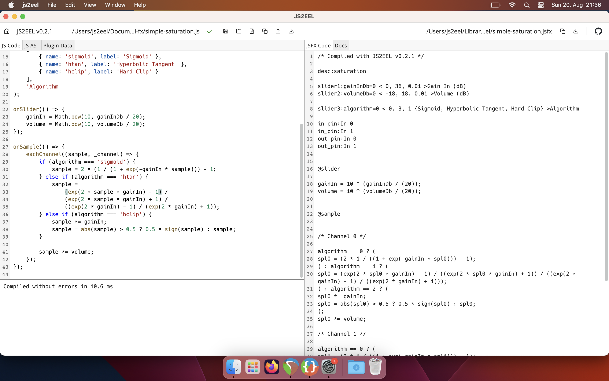
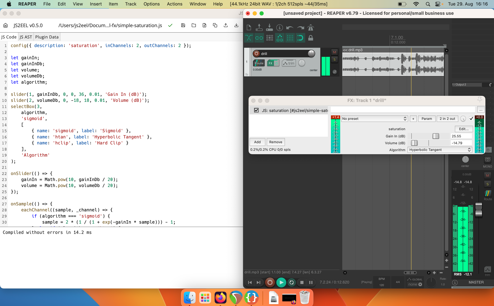

# JS2EEL

A compiler that enables you to write REAPER JSFX in JavaScript.

This is a very early version. The code is rough, and there might be bugs. And, as usual when writing audio effects: 📢 Turn your volume down, as loud noises might emerge from your code and harm your ears and equipment.

## Table of Contents

-   [Readme (this document)](./README.md)
-   [Getting Started: Your First JS2EEL Effect](./docs/getting-started.md)
-   [Keyboard Shortcuts](./docs/shortcuts.md)
-   [JS2EEL Examples](./examples)
-   [API Documentation](./docs/api-documentation.md)
-   [Feature Comparison with JSFX](./docs/feature-comparison.md)
-   [Limitations](./docs/limitations.md)
-   [Development](./docs/development.md)
-   [Useful Resources](./docs/useful-resources.md)
-   [Releases](https://github.com/steeelydan/js2eel/releases)
-   [Changelog](./docs/changelog.md)
-   [License](./LICENSE)

## Screenshots

Desktop App:

Compiled JSFX with live reload in REAPER:

## Why?

REAPER's built-in JSFX, powered by the EEL2 language, are awesome. They're realtime, they're low-level, and they're really _fast_. There's even an IDE integrated into REAPER. You can plug in your guitar, write some crazy DSP code, and instantly hear the results. Having JSFX at hand might be an unrivaled experience when learning audio DSP or rapidly drafting audio effects.

People have created amazing open source JSFX, some of which might rival commercial plugins: [Geraint Luff](https://geraintluff.github.io/jsfx/), [chkhld](https://github.com/chkhld/jsfx), [saike](https://github.com/JoepVanlier/JSFX), [tale](https://www.taletn.com/reaper/mono_synth/), [tukan](https://github.com/TukanStudios/TUKAN_STUDIOS_PLUGINS), and many others.

However, there are some drawbacks to EEL2 as a programming environment.

-   The inbuilt data structures are rather peculiar. For example, memory mapping is manual, involving the manual specification of offsets.
-   Invoking functions on objects that are not connected to that object is, in my current view, an arcane pattern. This is really hard to grasp and somewhat divergent compared to other modern programming languages.
-   Performance-wise, you get punished for using the inbuilt data structures. Buffer accesses and function calls take a toll on your CPU. If you want to write the fastest code possible, you need to inline everything. Take a look at this channel strip in JSFX: https://github.com/steeelydan/sd-jsfx/blob/main/src/channelstrips/sd_channelstrip.jsfx. Rather cumbersome and error-prone to inline the RBJ algorithms. But it's fast. This one, using JSFX functions, is way slower: https://github.com/steeelydan/sd-jsfx/blob/main/src/eq/sd_4band_eq_tidy_but_slow.jsfx.
-   All variables are global (except those explicitly declared as local within functions).

JS2EEL seeks to provide an alternative while retaining the immense advantages of EEL2/JSFX. It treats EEL as the compilation target. You write your FX code in a subset of JavaScript, which gets compiled into EEL2. When using the desktop app, the resulting JSFX is automatically reloaded in REAPER.

There are no performance losses, quite the opposite. User defined functions get inlined by default. There is an `EELArray` class for small data structures, which is also automatically inlined.

Once JS2EEL has matured, it hopes to provide a modern and highly accessible platform for learning audio DSP, prototyping effects and creating 'production-ready' open source JSFX. Above all, it seeks to amplify the joy of writing JSFX even more.

## Prerequisites

To hear your FX in action, the REAPER DAW must be installed on your system.

## Using the Web App

When using the EEL2JS web app (https://js2eel.org), simply copy the compiled code into an empty JSFX in REAPER.

## Using the Desktop App

When launching the desktop app, you choose an input folder for your JS source code and an output folder for the compiled code. After saving your code, the resulting JSFX will be updated within REAPER.

There are three ways to use the desktop app:

### a. Download an Executable

Go to https://github.com/steeelydan/js2eel/releases. Ideally, an executable for your operating system is available. Please note that the Windows executable is currently unsigned. I plan to do that as soon as possible.

### b. Build an Executable From Source

-   Have `Node.js` 18 or higher installed
-   Have a terminal emulator installed
    -   Linux, MacOS: `bash` or `zsh`
    -   Windows: `git bash` (included with `git`)
-   Clone this repo
-   Install all dependencies from `npm`: In `scripts`, run `./install.sh`
-   Make a distribution: In `scripts`, run `./dist.sh`
-   You'll find the built executable for your platform in the `dist` folder

### c. Run the Development Build

-   Have `Node.js` 18 or higher installed
-   Have a terminal emulator installed
    -   Linux, MacOS: `bash` or `zsh`
    -   Windows: `git bash` (included with `git`)
-   Clone this repo
-   Install all dependencies from `npm`: In `scripts`, run `./install.sh`
-   Open a different terminal session for each of the following steps
    -   Go to `compiler` and do `npm run dev`
    -   Go to `gui` and do `npm run dev`
    -   Go to `desktop` and do `npm run dev`. Now, the Electron build should open.

## Roadmap

It would be nice to have a full-fledged DSP environment with audio playback in the end, maybe a bit like [FAUST](https://github.com/grame-cncm/faust).

TBI:

-   Midi support
-   Function hoisting
-   File imports
-   CLI-only version with VSCode support, maybe as VSCode extension
-   How to distribute? ReaPack? Include JS code as comment?
-   E2E tests, especially for filehandling on desktop
-   Dark theme / custom themes
-   JSFX gfx, maybe with React/JSX
-   EEL parser & compiler
-   WebAssembly audio processing

## Copyrights etc.

REAPER® is a registered trademark of Cockos Incorporated.

JS2EEL is not affiliated with or endorsed by Cockos Incorporated.
